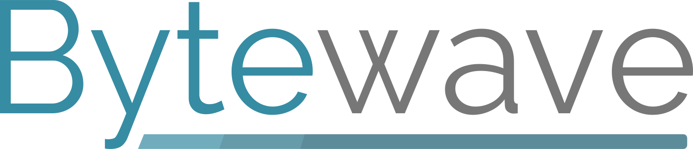

#### Welcome to the official Bytewave GitHub! :sparkles:

## About Us

We are a modern marketing and software company. We deliver high performance tools for business growth with low cost to our clients.

You can find our website, business tools, and open-sourced projects here.

## Reach Out

If you are interested in working with us, or contributing to our open-source projects, please reach out to our [info@bytewave.co](mailto:info@bytewave.co) email address or consult the project's `CONTRIBUTING.md` file.

Our website is [https://bytewave.co](https://bytewave.co) if you want to learn more about us!

### Social Media

 

### Tips and Donations

